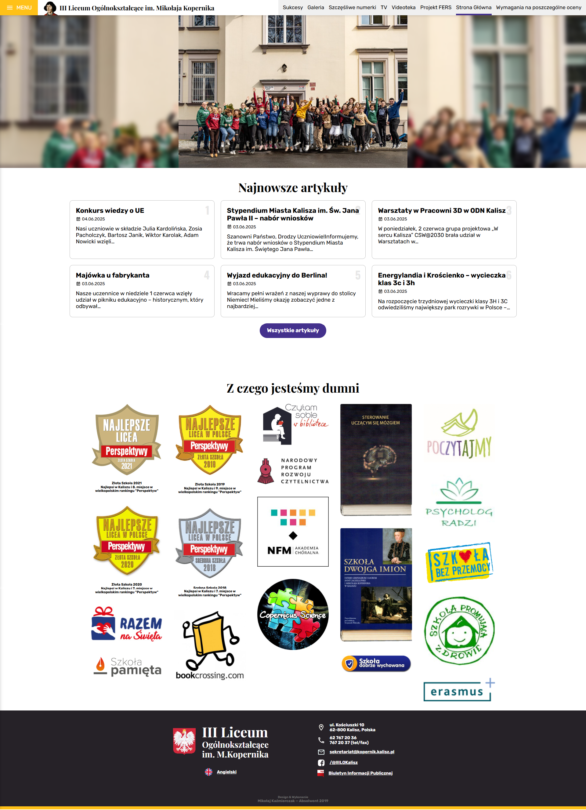
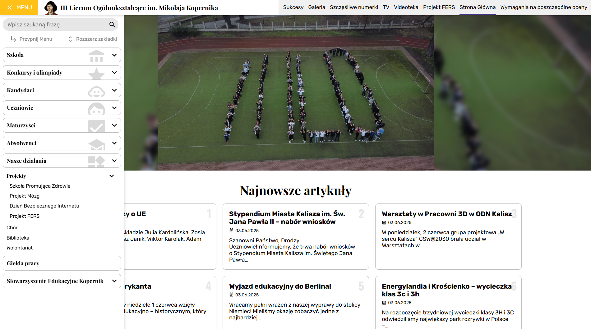
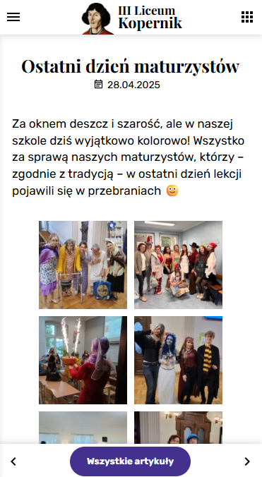
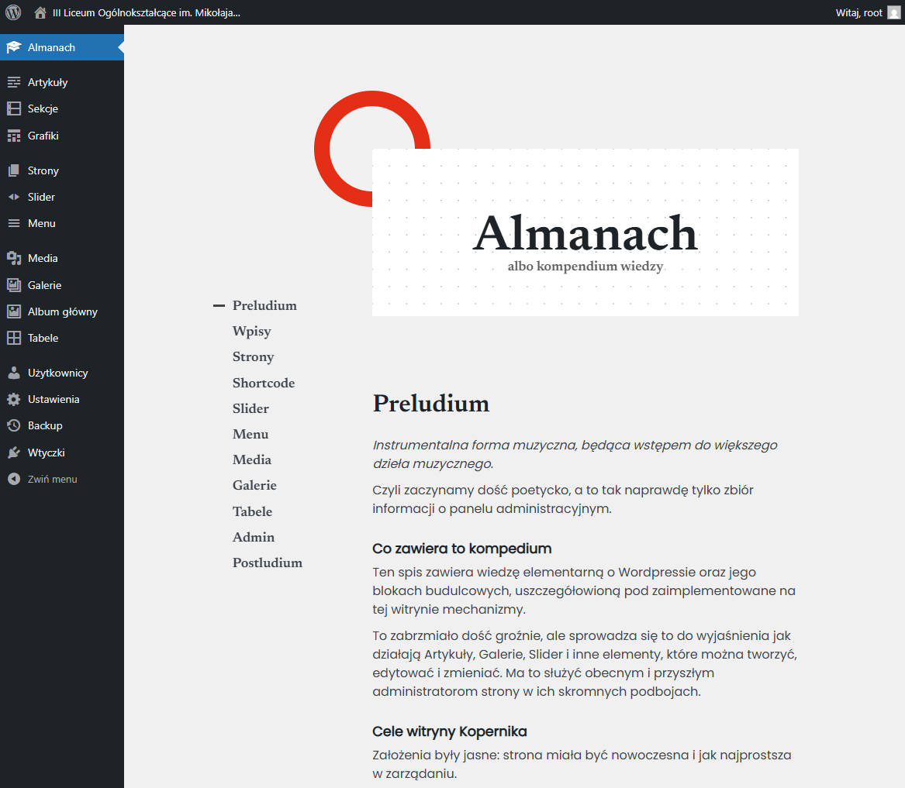

# kopernik-theme

This is a Wordpress theme along with an Almanac (a fancy word for a manual).

My High School needed a website with a set of typical requirements such as editing articles and subpages, modifying menus, and creating galleries and tables. The theme was built to meet these requirements.

Some less common features were also implemented, such as custom post types for special event announcements and graphical badges on the main page.

The theme was designed to be user-friendly for teachers, allowing them to easily manage content without needing extensive technical knowledge. This was achieved by creating a theme that is quite opinionated, but also extensively modifying the WordPress admin interface to simplify the user experience.

### The Main Page

A clean and simple design that focuses on the content.

### Menu

Carefully cathegorized menu with a focus on usability and clarity.\
Can be pinned to stay visible on the left whenever you visit the site.

### Article

Articles support a wide range of content types, including images, videos, and embedded content. The don't allow font customization to preserve a unified experience across the whole website.\
The screenshot is from a mobile device view for variety's sake.

### Almanac — a knowledge base

Painstakingly crafted to be as comprehensive as possible, the Almanac is a guide on how to use the theme and manage the website. It includes detailed instructions, tips, and best practices.

